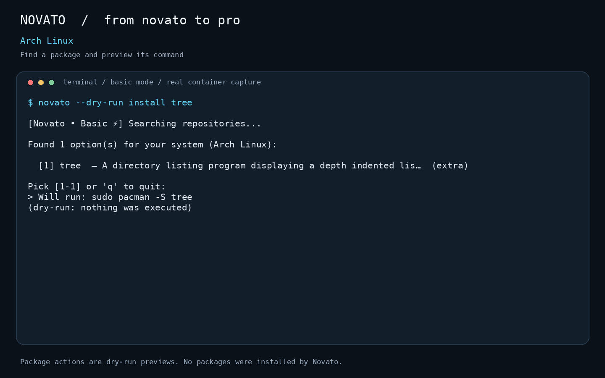
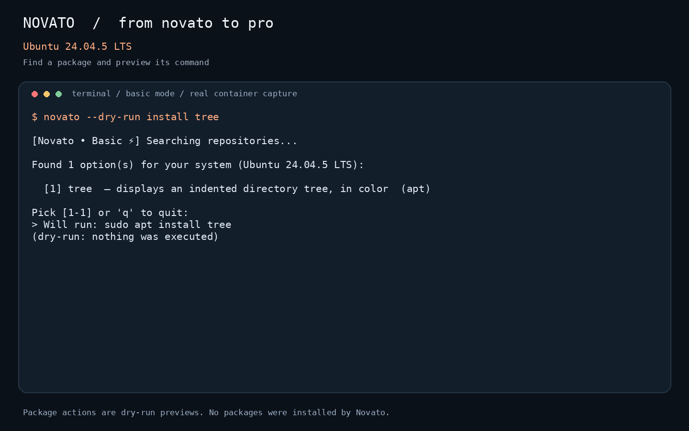
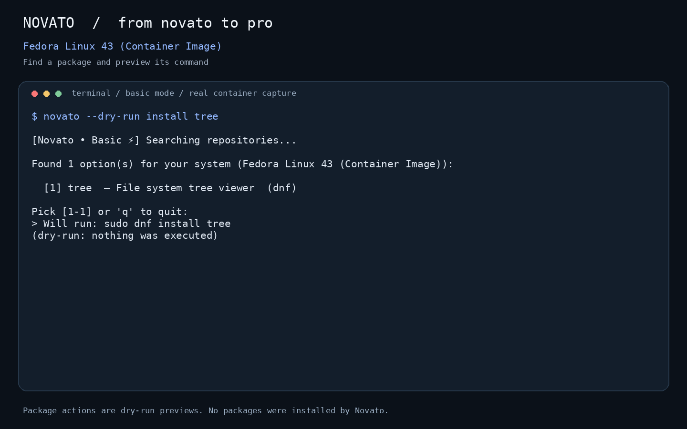
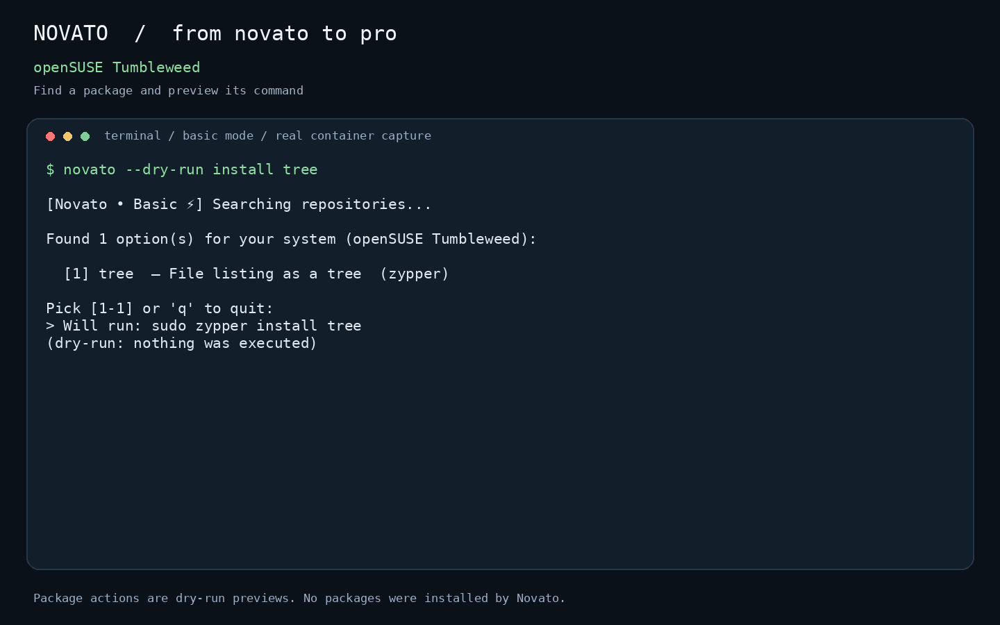

<div align="center">

# Novato 🌱

### Your words. Your distro. Your terminal.

Install by intent, understand commands, and learn Linux as you go.

[](https://github.com/Preethesh16/Novato/actions/workflows/tests.yml)


[](LICENSE)

[Get started](#get-started) · [Watch the demo](#watch-it-work) · [Command guide](#your-command-guide) · [Testing](docs/TESTING.md)

</div>

**Novato** means *beginner* in Spanish and Portuguese. Describe what you need;
Novato finds packages for your Linux distribution, shows the command, and asks
before running it. You can also look up commands, take a guided tutorial, inspect
storage, or enable an opt-in shell error helper.

```bash
novato "i want to edit videos"
novato /explain ls -la
novato "check space"
```

No AI account is required. **Basic mode** resolves requests locally with rules
and fuzzy matching. Repository searches, package downloads, and optional online
AI may still need a network connection.

## Watch it work


**[Watch / download the 72-second video](docs/media/novato-demo.mp4)** ·
[Captures and reproduction instructions](docs/media/README.md)

These are rendered captures of **real CLI runs in Linux containers**, using
live package metadata. Package actions use `--dry-run`: the video demonstrates
finding software and previewing the correct command, not completed installs.
The full video also shows distro detection and command explanations. It has
on-screen text and no audio.

| Arch · pacman | Ubuntu · apt |
|---|---|
|  |  |
| **Fedora · dnf** | **openSUSE · zypper** |
|  |  |

## Get started

You need **Linux, Python 3.10+, Git**, and either **pipx** or **uv**. Use your
distro's packages to install prerequisites; keep Novato in an isolated tool
environment instead of modifying the system Python.

### 1. Install the command

With pipx:

```bash
pipx install git+https://github.com/Preethesh16/Novato.git
pipx ensurepath
```

Or with uv:

```bash
uv tool install git+https://github.com/Preethesh16/Novato.git
uv tool update-shell
```

Open a new terminal after the PATH step, then check:

```bash
novato --version
novato --help
```

The repository is the installation source; a PyPI or AUR release is not required.
The optional [installer script](scripts/install.sh) uses pipx or uv and stops with
an explanation if neither is available.

### 2. Choose Basic mode

Your first normal command launches setup. Select **Basic** to begin without an
API key or model download. You can rerun setup with `novato /setup`.

```bash
novato /status
novato /cheat files
novato /explain ls -la
```

### 3. Preview an install

```bash
novato --dry-run "i want to edit videos"
```

Choose a numbered result. Novato prints the command for your package manager,
without executing it. Then, when you want to install:

```bash
novato "i want to edit videos"
```

Read the result list, select a package, review the exact command, and confirm.
The package manager can ask for your password and its own confirmation. On Arch,
Novato also offers a full system refresh; review the upgrade before accepting.
Press `q` at a selection menu to leave it.

### Update or uninstall Novato

Use the same tool you installed it with:

| Tool | Update | Remove |
|---|---|---|
| pipx | `pipx upgrade novato` | `pipx uninstall novato` |
| uv | `uv tool upgrade novato` | `uv tool uninstall novato` |

If you enabled the shell watcher, run `novato /mistake off` **before** uninstalling
and open a new terminal. Configuration and history remain in `~/.novato` unless
you remove them yourself. The [uninstaller](scripts/uninstall.sh) also offers to
remove them.

## Your command guide

Always prefix slash commands with `novato` in your shell.

| What you need | Try this | What happens |
|---|---|---|
| Find software | `novato "a private browser"` | Ranked package choices for your distro |
| Install a known package | `novato "install tree"` | Repository lookup and command confirmation |
| Remove a package | `novato "uninstall firefox"` | Matches installed packages, then asks |
| Learn a command | `novato /explain chmod 755 script.sh` | Breaks down the command and flags |
| Find a task command | `novato /man "extract a tar file"` | Shows instructions without execution |
| Do a task | `novato /do "rename a file"` | Shows a proposed command; may request details |
| Learn interactively | `novato /learn` | Guided lessons with saved progress |
| Get a reference | `novato /cheat files` | Short command reference |
| Check free space | `novato /space` | Read-only capacity report |
| Review cleanup | `novato /disk` | Deep scan and proposed cleanup actions |
| Inspect a port | `novato /process 8080` | Process information, with a separate stop offer |
| Explain installs | `novato /explain on` | Enables teaching blocks for installs |
| Catch shell errors | `novato /mistake on` | Installs an opt-in Bash/Zsh hook |
| Change AI mode | `novato /switch basic` | Selects Basic, Online, Offline, or Both |
| See settings | `novato /status` | Mode, distro, package manager, and shell |
| Repeat setup | `novato /setup` | Optional AI and helper configuration |
| See command list | `novato /help` | Built-in reference |

### Clean storage with context

Start with `novato /space` for a quick answer. Use `novato --dry-run /disk` to
inspect the cleanup workflow before allowing changes. Deep scans may take time.

The cleanup flow measures disk usage, identifies known download caches, and
shows a ranked plan with exact actions. The recommended batch requires
confirmation. Items that need your judgment—projects, models, build trees,
archives, and personal files—are reviewed separately. Select multiple review
rows with spaces, commas, or a range, such as `2 4 6` or `2-4`.

Eligible file actions move items to Trash first. Emptying Trash has its own
irreversible confirmation. Novato rechecks free space afterward; reclaimed
space may differ from estimates, especially with open files or asynchronous
Trash deletion. Read the [storage guide](USERMANUAL.md) before a large cleanup.

### Make mistakes, then learn from them

```bash
novato /mistake on
# Open a new Bash or Zsh session to load the hook.
novato /mistake off
```

The watcher responds to failed commands. It can suggest a correction and explain
it; you still review the proposed fix. Bash and Zsh are the supported hook
shells. The complete workflow is in the [user manual](USERMANUAL.md).

## Linux families

| Family | Examples recognized by detection | Package manager |
|---|---|---|
| Arch | Arch, Manjaro, EndeavourOS, Garuda, Artix | `pacman` |
| Debian | Debian, Ubuntu, Mint, Pop!_OS, elementary, Zorin, Kali, Raspbian | `apt` |
| Fedora | Fedora, RHEL, Rocky, AlmaLinux, CentOS | `dnf` |
| openSUSE | Tumbleweed, Leap, SLES | `zypper` |

Derivatives can resolve through `ID_LIKE` in `/etc/os-release`. Recognition does
not guarantee that every version or repository offers the same packages.
AUR packages need an installed helper; Novato does not send AUR-only packages
to pacman. Unsupported distributions cannot use the package installation flow.

See the [validation report](docs/TESTING.md) for the exact environments exercised,
commands checked, and remaining gaps. Container tests are not full desktop tests.

## Optional AI

| Mode | How it works | What you need |
|---|---|---|
| **Basic** | Local rules and fuzzy matching | Nothing extra |
| **Offline** | Local llamafile model | One-time model download and enough RAM |
| **Online** | Hosted Groq API | Network access and a Groq API key |
| **Both** | Groq, then local model, then Basic fallback | Optional key and local model |

```bash
novato /setup                   # configure optional AI
novato --download-model        # choose a model based on RAM
novato /switch offline
novato /switch basic
```

This version uses AI for intent resolution and explanations. The later agent
chat and agent-memory features were removed when restoring the requested
`57a01f4` baseline. Commands such as `novato chat` and `/memory` are not features
of this version.

Basic processing stays local. Online mode sends request data to Groq; don't put
secrets in prompts or error text. The key is stored in `config.json` with `0600`
permissions. Model downloads require network access even though subsequent
local inference is offline. See [architecture and privacy](DOCUMENTATION.md).

## Review before running

Novato previews state-changing commands and asks for confirmation. Its safety
layer blocks known destructive patterns and strips common auto-confirm flags.
These checks are guardrails, not a general-purpose security sandbox. Review
commands, package sources, and the consequences of system upgrades yourself.

`--dry-run` previews package/task execution and model download actions. It can
still perform searches, scans, write logs, and enter configuration flows. It is
not a promise of zero filesystem writes. Execution history is stored in
`~/.novato/history.log`; `NOVATO_HOME` can select a separate configuration folder.

## Troubleshooting

| Symptom | Next step |
|---|---|
| `novato: command not found` | Run your installer's PATH step above, then open a new shell |
| Python is “externally managed” | Use pipx or uv tool installation; avoid system `pip install` |
| No live repository results | Check connectivity and package metadata; offline candidates are suggestions, not verified availability |
| AUR helper missing | Set up a helper yourself, or choose an official repository package |
| Online AI fails | Check your key with `/setup`, or use `/switch basic` |
| Local model unavailable | Check `/status`; download/configure it or use Basic mode |
| Watcher doesn't appear | Open a fresh Bash/Zsh session after `/mistake on` |
| Storage space didn't increase as expected | Check `/space` after deletion settles; files can remain open |

## Develop and test

```bash
git clone https://github.com/Preethesh16/Novato.git
cd Novato
uv sync --frozen
uv run novato --help
uv run pytest --cov=novato --cov-report=term-missing
uv run ruff check .
uv build
```

Use a temporary `NOVATO_HOME` when testing to keep your normal configuration
separate. The automated suite mocks destructive actions, AI APIs, and downloads.
Real repository checks run in disposable Docker containers:

```bash
bash scripts/test-distros.sh apt
bash scripts/test-distros.sh dnf
bash scripts/test-distros.sh pacman
bash scripts/test-distros.sh zypper
```

[Testing and limitations](docs/TESTING.md) · [Full user manual](USERMANUAL.md) ·
[Architecture](DOCUMENTATION.md) · [Changelog](CHANGELOG.md) · [Roadmap](ROADMAP.md)

Contributions with reproducible bugs, focused tests, and new distro coverage are
welcome. Licensed under **GPL-3.0-or-later**; see [LICENSE](LICENSE).
